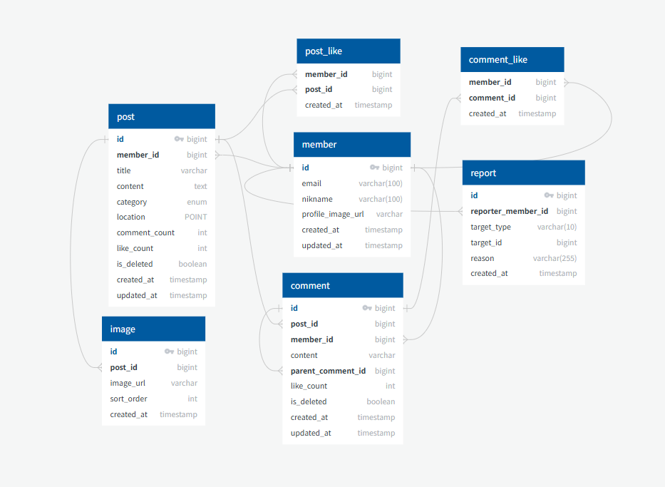

---------------------------
## Project Introduction

## 🎉 노크 (Noc) - 대학 축제 네트워킹 플랫폼  

 

 **축제 인파에** 어디서 뭐 하는지도 모르겠고, 누구랑도 안 친하다구요? 😥  
 
  
 **축제를 더 가볍고 즐겁게 누릴 수 있는 네트워킹 서비스, `노크(Noc)`!** ✨  
 

📍 부스 정보  🍻 주점 위치  ⚡ 번개 모임  🔎 분실물 제보까지!  
 

사람은 낯가려도, **축제는 낯가리지 말자구요!** 🙈  
 

지금, **노크하세요. 축제가 달라집니다.** 🎈  
  

---------------------------
## Architecture Diagram

---------------------------

## ERD Diagram

   
---------------------------

## Collaboration Tool

---------------------------

## Member
- [김채리](https://github.com/cherrie-k)
- [박재윤](https://github.com/qkrwodsbfjq)
- [신건우](https://github.com/gitwub5)
- [한승헌](https://github.com/seungheon123)

---------------------------

## Commit Convention
| 태그이름    | 내용         |
|---------|------------|
| `Feat`  | 새로운 기능 (파일 추가도 포함)을 추가할 경우|
| `Fix `  | 버그를 고친 경우|
| `Update` | 코드 수정을 한 경우 
| `!HOTFIX` | 급하게 치명적인 버그를 고쳐야하는 경우|
| `Style`   |  코드 포맷 변경, 세미 콜론 누락, 코드 수정이 없는 경우|
| `Refactor` | 프로덕션 코드 리팩토링|
| `Comment` | 필요한 주석 추가 및 변경|
| `Docs`	   |  문서를 수정한 경우|
| `Test`    |테스트 추가, 테스트 리팩토링(프로덕션 코드 변경 X)|
| `Chore`	  | 빌드 태스트 업데이트, 패키지 매니저를 설정하는 경우(프로덕션 코드 변경 X)|
| `Rename`  |파일 혹은 폴더명을 수정하거나 옮기는 작업만인 경우|
| `Remove`  | 파일을 삭제하는 작업만 수행한 경우|
 

1. issue 등록
2. 로컬 git에서 main으로 브랜치 이동 후 pull로 메인 최신화
3. issue/번호로 브랜치 만들고 push
4. pull request 보내고 코드 리뷰자, 작성자 선택
5. 코드 리뷰 후 merge
